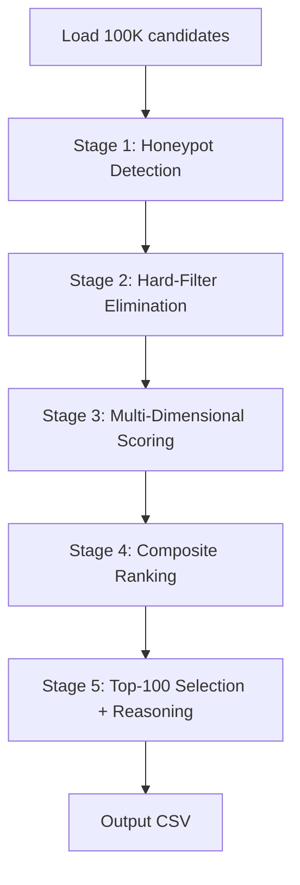

# RedRob Hackathon — Intelligent Candidate Ranking System

## Challenge Summary

Build a system that ranks **100,000 candidates** against a **Senior AI Engineer (Founding Team)** job description at Redrob AI, producing a **top-100 CSV** with scores and reasoning.

### Key Constraints
| Constraint | Value |
|---|---|
| Output | Exactly 100 candidates, ranks 1-100, with scores & reasoning |
| Compute | 5 minutes, 16GB RAM, CPU only, **no network** |
| Format | CSV: `candidate_id, rank, score, reasoning` |
| Traps | ~80 honeypot candidates with impossible profiles → **auto-disqualify** |
| Submissions | Max 3 (last valid counts) |
| Evaluation | NDCG@10 (50%) + NDCG@50 (30%) + MAP (15%) + P@10 (5%) |

---

## What the JD Actually Wants (Decoded)

The JD is deliberately written to test whether you **read between the lines**. Here's what matters:

### Must-Haves (Hard Requirements)
1. **5-9 years experience** (flexible, but ≥4 with strong signals)
2. **Production ML/AI at product companies** — not consulting (TCS/Infosys/Wipro/Accenture/Cognizant/Capgemini = negative signal if entire career)
3. **Embeddings + retrieval systems** deployed in production (sentence-transformers, FAISS, Milvus, etc.)
4. **Vector DB / hybrid search** operational experience
5. **Strong Python**
6. **Ranking evaluation frameworks** (NDCG, MRR, MAP, A/B testing)
7. **Located in or willing to relocate to India** (Pune/Noida/Hyderabad/Mumbai/Delhi NCR)

### Strong Positives
- LLM fine-tuning (LoRA, QLoRA, PEFT)
- Learning-to-rank models
- HR-tech / recruiting-tech / marketplace experience
- Open-source AI/ML contributions
- Career shows building end-to-end search/ranking/recommendation systems

### Explicit Disqualifiers (from JD)
- **Pure research / academic** without production deployment
- **Only LangChain / recent API-calling "AI experience"** (< 12 months)
- **Hasn't written production code in 18+ months** (architecture-only roles)
- **Title-chasers** (job-hopping every 1.5 years for titles)
- **Entire career at consulting firms** (TCS, Infosys, Wipro, Accenture, Cognizant, Capgemini)
- **Computer vision / speech / robotics only** without NLP/IR exposure
- **Only closed-source proprietary work** for 5+ years

### The Keyword Trap (Critical)
> *"The right answer is NOT find candidates whose skills section contains the most AI keywords. That's a trap we've explicitly built into the dataset."*

A Marketing Manager with 9 "AI core skills" but no real ML career history is a **trap**, not a match. The sample_submission.csv is deliberately bad — it ranks HR Managers and Accountants with AI keywords.

---

## Proposed Architecture

### Pipeline Overview



### Stage 1: Honeypot Detection (~80 candidates)
Detect **impossible profiles** — these are tier-0 forced in ground truth:

| Check | Example |
|---|---|
| Experience vs. timeline mismatch | 8 years at company founded 3 years ago |
| Impossible skill claims | "Expert" in 10+ skills with 0 months usage |
| Career date impossibilities | End date before start date, overlapping dates adding up to more years than age allows |
| Impossible ages | PhD + 15 years exp but graduated 2023 |
| Skill assessment vs proficiency contradictions | "Expert" proficiency but assessment score < 20 |

> [!IMPORTANT]
> Honeypot rate > 10% in top 100 = **disqualification**. This filter must be aggressive.

### Stage 2: Hard-Filter Elimination
Remove candidates who are **explicitly disqualified** by the JD:

1. **Pure non-technical roles** with zero ML/AI career history (HR Managers, Accountants, etc. whose career descriptions show no ML work)
2. **Entire career at consulting firms** (TCS, Infosys, Wipro, Accenture, Cognizant, Capgemini) with no product company experience
3. **Location impossible** — outside India with `willing_to_relocate: false` and country ≠ India
4. **Zero relevant experience** — no career history touching ML/AI/search/ranking/retrieval

### Stage 3: Multi-Dimensional Scoring (6 Axes)

#### Axis 1: Skills Relevance (weight: 0.25)
- **Core skills match**: Embeddings, vector DBs, Python, NLP, ranking/retrieval, ML frameworks
- **Proficiency-weighted**: Expert > Advanced > Intermediate > Beginner
- **Duration-weighted**: Longer usage = more credible
- **Assessment-validated**: Redrob assessment scores back up claimed proficiency
- **Anti-keyword-stuffing**: Penalize candidates with many AI keywords but non-technical job titles

#### Axis 2: Career Quality (weight: 0.30)
- **Product company experience** vs consulting (product = strong positive)
- **Title progression relevance**: AI/ML Engineer, Data Scientist, Backend Engineer → strong; HR Manager, Accountant → weak
- **Duration & stability**: 2+ years per role = positive; < 1.5 year average = "title chaser" penalty
- **Description semantic analysis**: Do role descriptions mention building ML systems, deploying models, search infrastructure?
- **Current relevance**: Is the most recent role AI/ML-adjacent?

#### Axis 3: Behavioral Signals (weight: 0.20)
- **Availability multiplier**: `open_to_work_flag`, `last_active_date` recency, `recruiter_response_rate`
- **Engagement quality**: `interview_completion_rate`, `offer_acceptance_rate`, `profile_completeness_score`
- **Market signal**: `saved_by_recruiters_30d`, `search_appearance_30d`, `profile_views_received_30d`
- **Platform verification**: `verified_email`, `verified_phone`, `linkedin_connected`
- **Notice period**: Sub-30 days = bonus; 60+ days = slight penalty per JD

#### Axis 4: Experience Fit (weight: 0.15)
- **Sweet spot**: 5-9 years total, 4-5 in applied ML/AI
- **Gaussian scoring**: Peak at 6-8 years, tapering outside 4-12
- **Recency of production code**: Recent hands-on coding = positive

#### Axis 5: Education Fit (weight: 0.05)
- **Tier**: tier_1 > tier_2 > tier_3 > tier_4
- **Relevance**: CS, ML, Data Science, Mathematics > other fields
- **Degree level**: Slight bonus for MS/PhD in relevant fields (but JD doesn't emphasize this)

#### Axis 6: Location & Logistics (weight: 0.05)
- **India-based**: Strong positive (Pune/Noida/Hyderabad/Mumbai/Delhi NCR)
- **Willing to relocate**: Positive if outside preferred cities
- **Work mode**: Hybrid/flexible preferred per JD
- **Expected salary**: Sanity check — extremely high or low may be misaligned

### Stage 4: Composite Score
```
final_score = (skills × 0.25 + career × 0.30 + behavioral × 0.20 + 
               experience × 0.15 + education × 0.05 + logistics × 0.05) × availability_multiplier
```

The **availability_multiplier** (0.3–1.0) gates everything:
- `last_active_date` > 6 months ago → heavy penalty
- `recruiter_response_rate` < 0.1 → heavy penalty  
- `open_to_work_flag` = false AND low engagement → moderate penalty

### Stage 5: Reasoning Generation
For each top-100 candidate, generate a 1-2 sentence reasoning:
```
"{title} with {years} yrs at {company_type} companies; {key_skills}; {behavioral_note}"
```

---

## Proposed Changes

### Project Structure

#### [NEW] [rank.py](file:///c:/Users/Rose/Videos/FUTURE/RedRob%20Hackathon/rank.py)
Main ranking script — single-command entry point:
```bash
python rank.py --candidates ./India_runs_data_and_ai_challenge/candidates.jsonl --out ./submission.csv
```

#### [NEW] [src/pipeline.py](file:///c:/Users/Rose/Videos/FUTURE/RedRob%20Hackathon/src/pipeline.py)
Orchestrates the 5-stage pipeline.

#### [NEW] [src/honeypot_detector.py](file:///c:/Users/Rose/Videos/FUTURE/RedRob%20Hackathon/src/honeypot_detector.py)
Detects ~80 honeypot candidates with impossible profiles.

#### [NEW] [src/hard_filters.py](file:///c:/Users/Rose/Videos/FUTURE/RedRob%20Hackathon/src/hard_filters.py)
Eliminates explicitly disqualified candidates per JD.

#### [NEW] [src/scorers.py](file:///c:/Users/Rose/Videos/FUTURE/RedRob%20Hackathon/src/scorers.py)
Six scoring axes: skills, career, behavioral, experience, education, logistics.

#### [NEW] [src/ranker.py](file:///c:/Users/Rose/Videos/FUTURE/RedRob%20Hackathon/src/ranker.py)
Combines scores, sorts, produces top-100 with reasoning.

#### [NEW] [src/config.py](file:///c:/Users/Rose/Videos/FUTURE/RedRob%20Hackathon/src/config.py)
All tunable constants (weights, thresholds, keyword lists, company lists).

#### [NEW] [requirements.txt](file:///c:/Users/Rose/Videos/FUTURE/RedRob%20Hackathon/requirements.txt)
Minimal dependencies — pure Python + standard library where possible. No heavy ML frameworks needed since we're doing rule-based + heuristic scoring (no embeddings model needed within the 5-min CPU constraint).

#### [NEW] [README.md](file:///c:/Users/Rose/Videos/FUTURE/RedRob%20Hackathon/README.md)
Setup instructions and reproduction commands for Stage 3.

---

## Open Questions

> [!IMPORTANT]
> **Q1: Approach — Pure heuristic vs. lightweight embeddings?**
> The 5-min CPU-only constraint is tight for 100K candidates. Two approaches:
> - **Option A (Recommended)**: Pure rule-based + NLP heuristics using keyword matching, regex, and weighted scoring. Zero dependencies on ML models. Extremely fast, fully reproducible.
> - **Option B**: Pre-compute sentence embeddings offline (allowed outside 5-min window), then do cosine-similarity ranking at runtime. More sophisticated but adds complexity and pre-computation step.
> 
> I recommend **Option A** given the competition structure — the JD is very specific, so semantic understanding can be encoded as rules. Thoughts?

> [!IMPORTANT]  
> **Q2: Sandbox platform preference?**
> Submission requires a hosted sandbox. Options:
> - **Streamlit Cloud** (interactive UI, free tier)
> - **HuggingFace Spaces** (Gradio-based, free tier)
> - **Google Colab** (notebook, free tier)
> 
> I recommend **Streamlit Cloud** for the best demo experience. Preference?

> [!IMPORTANT]
> **Q3: Team info needed for submission metadata**
> The submission portal requires: Team name, Primary contact name/email/phone, Team member list. Please provide these when ready.

---

## Verification Plan

### Automated Tests
1. **Format validation**: Run against expected CSV spec (100 rows, unique IDs, descending scores, ranks 1-100)
2. **Honeypot check**: Verify zero honeypots in top-100 (cross-reference with detected honeypots)
3. **Sanity checks**: 
   - No HR Managers / Accountants / Graphic Designers in top-20
   - Top-10 should be ML/AI Engineers or Data Scientists at product companies
   - All candidate_ids exist in `candidates.jsonl`

### Manual Verification
1. Read top-20 candidate profiles manually to verify quality
2. Check reasoning strings are meaningful and accurate
3. Verify score distribution is smooth (no cliff-drops)
4. Confirm execution completes in < 5 minutes on a standard machine
